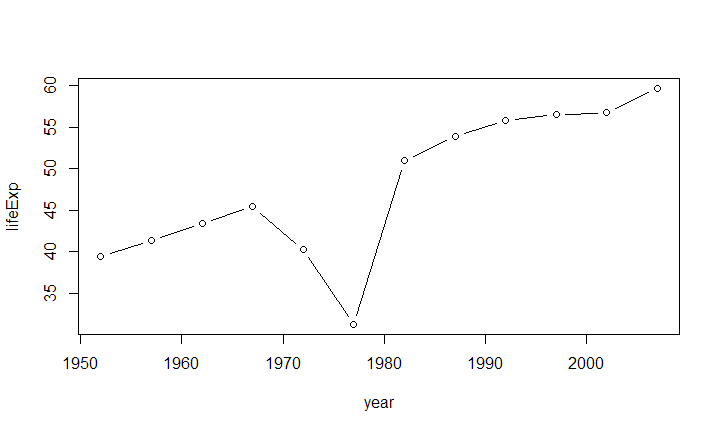

## Overview

This is exercise 3 in homework 1. In this exercise, we will present the exploration of gapminder in slides

## Basic Usage

- Source the library


```r
library(gapminder)
library(dplyr)
```
- Intro from the R Studio: 


```r
?gapminder
```

## Basic Usage (2)
* Headers for gapminder

```r
head(gapminder)
```

```
## # A tibble: 6 x 6
##   country     continent  year lifeExp      pop gdpPercap
##   <fct>       <fct>     <int>   <dbl>    <int>     <dbl>
## 1 Afghanistan Asia       1952    28.8  8425333      779.
## 2 Afghanistan Asia       1957    30.3  9240934      821.
## 3 Afghanistan Asia       1962    32.0 10267083      853.
## 4 Afghanistan Asia       1967    34.0 11537966      836.
## 5 Afghanistan Asia       1972    36.1 13079460      740.
## 6 Afghanistan Asia       1977    38.4 14880372      786.
```

## Here is a Summary 

```r
summary(gapminder)
```

```
##         country        continent        year         lifeExp     
##  Afghanistan:  12   Africa  :624   Min.   :1952   Min.   :23.60  
##  Albania    :  12   Americas:300   1st Qu.:1966   1st Qu.:48.20  
##  Algeria    :  12   Asia    :396   Median :1980   Median :60.71  
##  Angola     :  12   Europe  :360   Mean   :1980   Mean   :59.47  
##  Argentina  :  12   Oceania : 24   3rd Qu.:1993   3rd Qu.:70.85  
##  Australia  :  12                  Max.   :2007   Max.   :82.60  
##  (Other)    :1632                                                
##       pop              gdpPercap       
##  Min.   :6.001e+04   Min.   :   241.2  
##  1st Qu.:2.794e+06   1st Qu.:  1202.1  
##  Median :7.024e+06   Median :  3531.8  
##  Mean   :2.960e+07   Mean   :  7215.3  
##  3rd Qu.:1.959e+07   3rd Qu.:  9325.5  
##  Max.   :1.319e+09   Max.   :113523.1  
## 
```

## Here is a graph for the average life exp for Combodia from 1950 to 2000

```r
plot(lifeExp ~ year, gapminder, subset = country == "Cambodia", type = "b")
```

<!-- -->

## Analysis with dataset
- How many unique countries does the data contain, by continent?

```r
gapminder %>%
  group_by(continent) %>%
  summarize(n_obs = n(), n_countries = n_distinct(country))
```

```
## # A tibble: 5 x 3
##   continent n_obs n_countries
##   <fct>     <int>       <int>
## 1 Africa      624          52
## 2 Americas    300          25
## 3 Asia        396          33
## 4 Europe      360          30
## 5 Oceania      24           2
```

## Analysis with dataset (2)
- By continent, which country experienced the sharpest 5-year drop in life expectancy and what was the drop?


```
## # A tibble: 5 x 3
## # Groups:   continent [5]
##   continent country     worst_le_delta
##   <fct>     <fct>                <dbl>
## 1 Africa    Rwanda             -20.4  
## 2 Asia      Cambodia            -9.10 
## 3 Americas  El Salvador         -1.51 
## 4 Europe    Montenegro          -1.46 
## 5 Oceania   Australia            0.170
```
